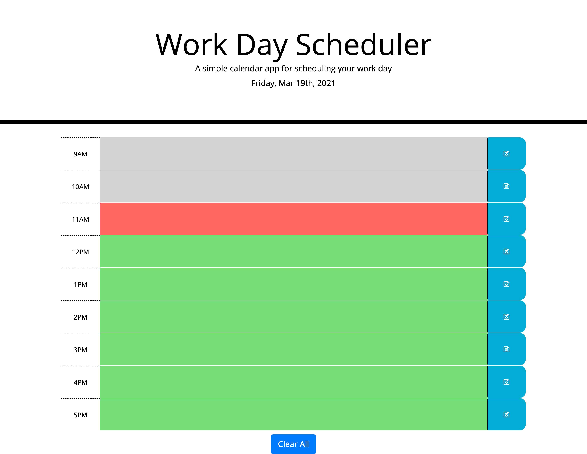
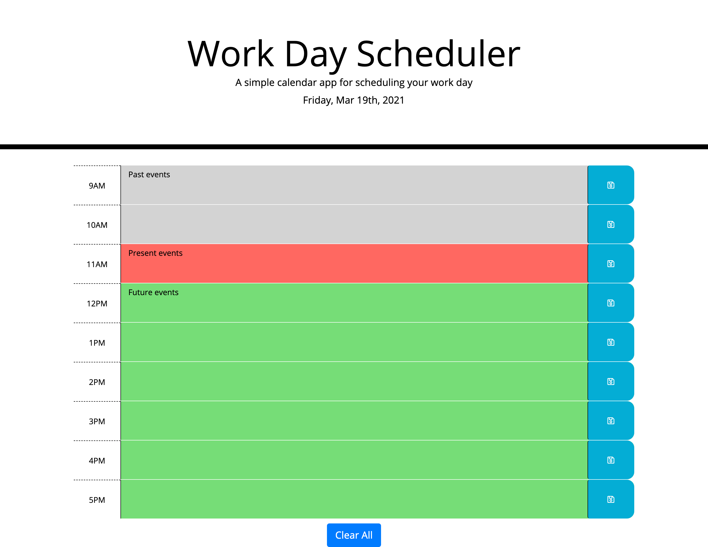
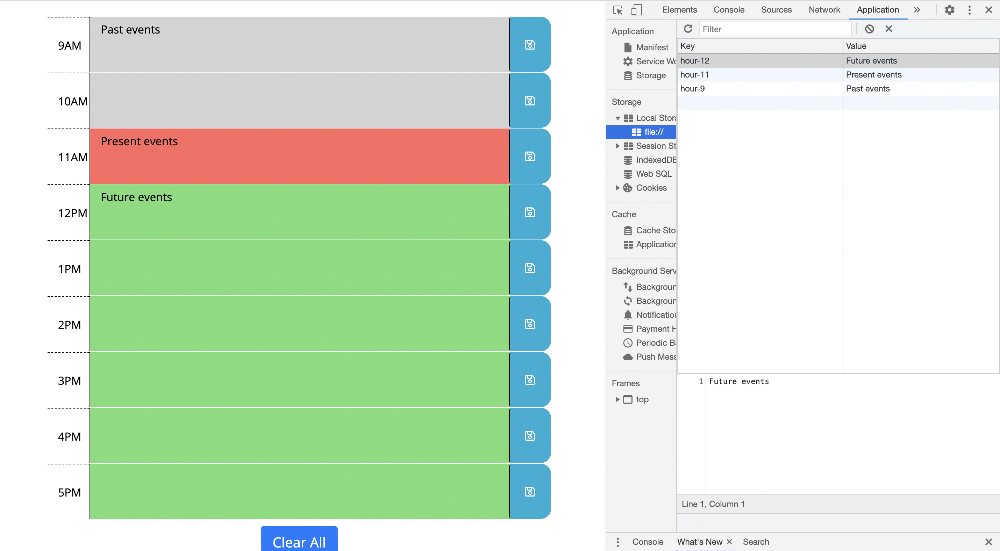
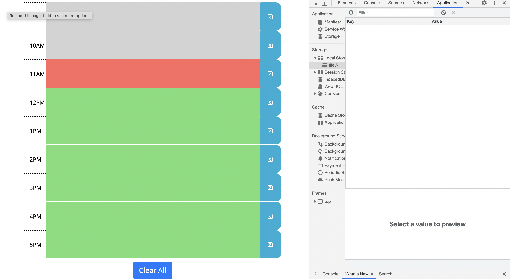

# Day-Planner

## Table of contents

* General info
* Specifics
* Screenhots
* Deployment of application
* Comments

## General info

 Day Planner was built based on the homework criteria. Css file was predetermined, html file was partly given as well.  

## Specifics
 
 Day planner allows you to write and save tasks you want to accomplish during the working hours, 9am-5pm. Colours for every individual hour block change based on the current time. Grey represents the past, red is present, green is future. You can delete all saved information on the schedule as well as in local storage by clicking “Clear All” button. Day on the top represent current day and changes every day in real time. If you will refresh the page without clicking on save icon, everything you wrote won’t stay, and wouldn’t be stored at local storage. 

## Screenhots

## Deployment of application
To run a project, please follow the link [https://sheymanidze.github.io/Day-Planner/](https://sheymanidze.github.io/Day-Planner/)

## Comments

 Calendar can be incorporated on the page in order to have ability to plan ahead, and save tasks for upcoming days, as well as opportunity to view previous tasks. Also, after clicking on save icon, we can include message, that disappears in couple seconds, confirming that the information was saved.